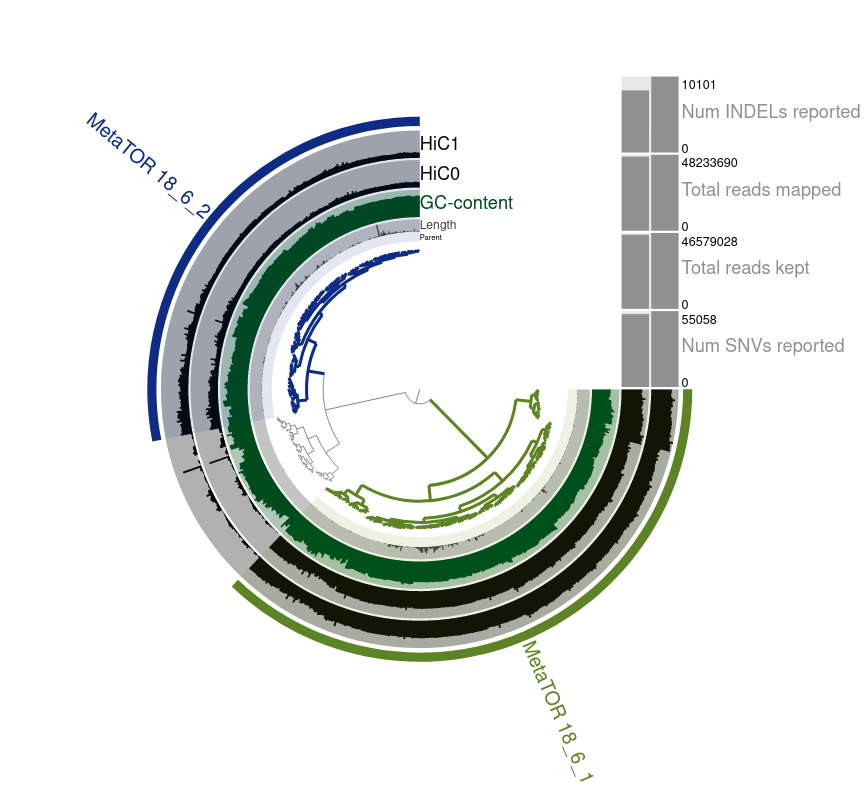
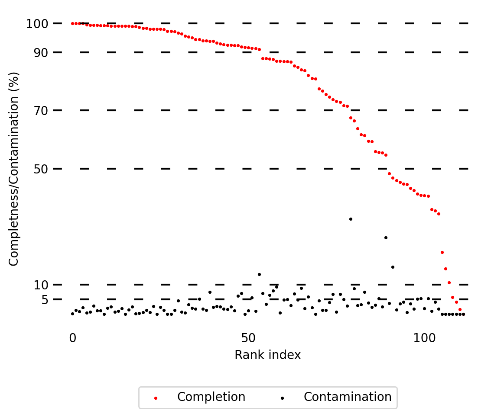
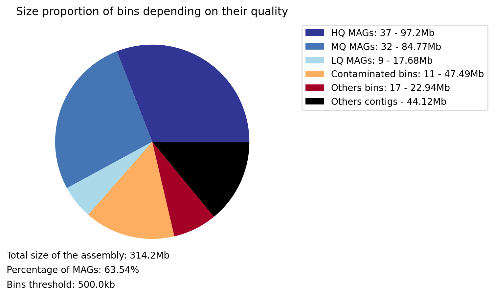
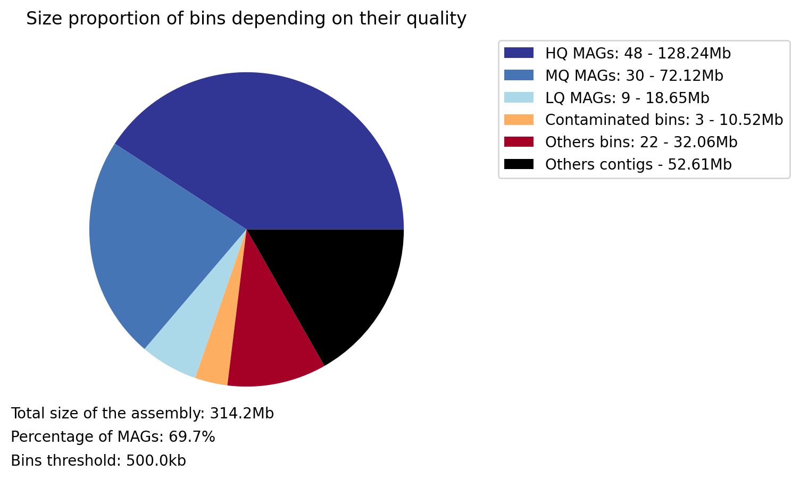

# Manual curation of the contaminated MetaTOR MAGs with anvio

The anvio [[1]](#References) manual curation of the MAGs is a step which is time consuming. However, it has very good performance to remove the residual contamination from metaTOR [[2]](#References) MAGs. Indeed, if you choose to have a 500bp threshold size, small contigs allow to recover more complete MAGs, but they will also increase the noise and the contamination. Anvio is an anlysis and visualization platform, the general tutorial for metagenomic workflow is available [here](https://merenlab.org/2016/06/22/anvio-tutorial-v2/). Its manual curation is based on a clustering of both the coverage and the sequence of the contigs. As anvio is based on differential coverage across sample, you should put all your different libraries separated and you can use both shotgun and HiC libraries. Here we will just show the result with two different HiC libraries.

## Table of contents

* [Requirements](#Requirements)
* [Input data](#Input-data)
* [A. Build anvio database](#A.-Build-anvio-database)
* [B. Build anvio coverage profile](#B.-Build-anvio-coverage-profile)
* [C. Refine the bins](#C.-Refine-the-bins)
* [References](#References)

## Requirements

* [Anvio](https://merenlab.org/software/anvio/) (version 7)
* [pyfastx](https://github.com/lmdu/pyfastx) (version 0.8.4). If you have used metaTOR, it's already installed as it's a dependance of metaTOR.

## Input data

As input data we will use the output of the [metaTOR (v1.1.1) tutorial](https://github.com/koszullab/metaTOR/blob/master/example/metator_tutorial.md) based on  the metaHiC sample from [Marbouty *et al.*, eLife, 2021](https://elifesciences.org/articles/60608). The accession number of the fastq sequences is SRR13435231 and the assembly accession number is ASM1314648v1 in the BioProject PRJNA627086 on the NCBI database. To have more contacts in the map we also use the MluCI library (SRR13435230) made on the same sample.

## A. Build anvio database

The first thing to do is to build the anvio database from the fasta assembly. To reduced the size of the database, we will extract the contigs of the final bins that we want to visualize in anvio and cure. To extract the contigs in a new fasta, we will pyfastx.

```sh
mkdir -p anvio
cut -f1 metator_folder/binning.txt > anvio/list_contigs.txt
pyfastx extract -l anvio/list_contigs.txt -o anvio/bin_contigs.fa assembly.fa
```

### Build the contigs database

Anvio needs to have simple fasta sequence name. First make sure your fasta have simples names and reformat them if necessary. You can have a look [here](https://merenlab.org/2016/06/22/anvio-tutorial-v2/#take-a-look-at-your-fasta-file)

Once our fasta is ready, we can build the anvio database. The -L 0 means that we do not want to split our contisg and -n is the name of our project.

```sh
anvi-gen-contigs-database -f anvio/bin_contigs.fa -o anvio/bin_contigs.db -n metaTOR_tutorial -L 0 -T 16
```

### Runs the hmm profiles and definde the taxonomy with anvio

Anvio have some default database of HMM profiles to annotate your profiles. This annotation are really useful because they show you the . Here we present them with the default HMM profiles from anvio. But you could also build your own HMM profiles if you want. A nice tutorial to do that is available [here](https://merenlab.org/2016/05/21/archaeal-single-copy-genes/).

```sh
anvi-run-hmms -c anvio/bin_contigs.db -T 16
anvi-run-scg-taxonomy -T 16 -c anvio/bin_contigs.db
```

**Optional:**

You can also use HMM profiles to scan for tRNAs. To do so run the previous command with the following parameter `--also-scan-trnas`.

* **tRNA scan**

```sh
anvi-run-hmms -c anvio/bin_contigs.db --also-scan-trnas -T 16
```

* **Annotating your contigs database**

Anvio have a function to annotate genes in your contigs database with functions from the NCBI’s Clusters of Orthologus Groups. A more complete explanation of this annotation is available [here](https://merenlab.org/2016/10/25/cog-annotation/).

```sh
anvi-run-ncbi-cogs -T 16 --sensitive -c anvio/bin_contigs.db
```

You can also import your own annotation from your favorite program using `anvi-import-functions`. A more detailed tutorial on this is explained [here](https://merenlab.org/2016/06/18/importing-functions/)

* **Add taxonomy to your contigs database**

It's possible to add taxonomy annotations in your database. The anvio tutorial to do it is available [here](https://merenlab.org/2016/06/18/importing-taxonomy/)

* **Display assembly statistics**

A small command to display statistics on the assembly.

```sh
anvi-display-contigs-stats anvio/bin_contigs.db
```

Anvio is very powerful tool which allows much more than we are presenting here. Feel free to look at what they are proposing or to add your own annotations from your analysis to the contigs database. As it's a powerful visualization tools it could be very useful to manual curation or/and to further analysis.

## B. Build anvio coverage profile

### Prepare the alignment files

To build the library profiles, anvio need the sorted bam indexed. They have a script to process the bam. In our example, as we have multiple files we will use a for loop. We only use the forward reads alignment as it will be redundant with the reverse alignment.

```sh
for i in `seq 0 1` ;
do anvi-init-bam metator_folder/alignment_"$i"_for.bam -o metator_folder/alignment_"$i"_for_sorted.bam ;
done
```

### Build the coverage profile

Once the bam are sorted and indexed, we can build the anvio profile. All the profiles are made separately and then merged. We put the following parameters to go fast, but you could look on the documentation and compute a more complete profile:

* --skip-hierarchical-clustering : To avoid to do the clustering on whole dataset which is too heavy. It will be made for each bin separately when we call them.
* --skip-SNV-profiling : Skip the characterization of single-nucleotide variants (SNVs) for every nucleotide position (you will definitely gain a lot of time if you do that, but then, you know, maybe you shouldn’t).
* -M: minimum contig length here put to 500 as in the initial assembly used by MetaTOR.
* -S: Name of the profile.
* --contigs-of-interest: The list of contigs present in the database.

```sh
for i in `seq 0 1` ;
do echo "$i" ;
anvi-profile -T 16 -M 500 --skip-hierarchical-clustering --skip-SNV-profiling -S HiC"$i" -c anvio/bin_contigs.db -o anvio/HiC"$i" -i metator_folder/alignment_"$i"_for_sorted.bam --contigs-of-interest anvio/list_contigs.txt ;
done
anvi-merge -W -S HiC -o anvio/HiC -c anvio/bin_contigs.db anvio/HiC*/PROFILE.db
```

### Import binning

Once the profile has been made, you can load your own binning. Here we show an example with MetaTOR, but if you have made another binning, feel free to use it.

```sh
anvi-import-collection -c anvio/bin_contigs.db -p anvio/HiC/PROFILE.db -C METATOR --contigs-mode metator_folder/binning.txt
```

## C. Refine the bins

### Manual refinement of the bins

Now you are finally ready to the manual curation of your MAGs. Here it's an example of command line to launch the intertacive interface of anvio with the MAGs 15_0. I won't do again the tutorial to explain how to clean it as it's available [here](https://merenlab.org/2015/05/11/anvi-refine/) and a more complete one [here](https://merenlab.org/2017/01/03/loki-the-link-archaea-eukaryota/).

```sh
#anvi-refine -c anvio/bin_contigs.db -p anvio/HiC/PROFILE.db -C METATOR -b MetaTOR_1_1
```

Here it's two examples of the manual cleaning. In the first one, we present an example of cleaning one bin, and in the second we show an example of splitting one bin in two high quality bins.

|Example 1: MetaTOR_1_2|Example 2: MetaTOR_18_6|
|:-:|:-:|
|||

|Bin|Before manual curation|After manual curation|
|:-:|:-:|:-:|
||Completness - Contamination|Completness - Contamination|
|MetaTOR_1_2|97.2 - 19.7|95.8 - 9.9|
|MetaTOR_18_6_1|95.8 - 98.6|94.4 - 0.0|
|MetaTOR_18_6_2|x - x|93.0 - 0.0|

### Export the new binning

Once you are done your manual refinement and are happy with you could export it in a two column text file similar as the `binning.txt` file from metaTOR.

```sh
anvi-export-collection -p anvio/HiC/PROFILE.db -C METATOR -O anvio/anvio_binning
```

### Output analysis

From the new clustering, it's possible to build new fasta sequence for each new bin and check the qualities of the new MAGs with checkM. These are metaTOR figures with the old and new bins to compare the quality of the binning before and after the manual curation.

| |MetaTOR binning|MetaTOR binning with anvio manual curation step|
|:-:|:-:|:-:|
|**Completion/contamination distribution**|||
|**Quality distribution of the bins**|||

So here we present how anvio could be used to manually removed contamination from MetaTOR bins. However, as we said before anvio is very powerful visualization tools and even if this step is time consumming it can be reused to do further analysis on the bins and to visualize them.

## References

* [1] [Community-led, integrated, reproducible multi-omics with anvi’o](https://doi.org/10.1038/s41564-020-00834-3), A. M. Eren, E. Kiefl, A. Shaiber, I. Veseli, S. Miller, M. Schechter, I. Fink, J. Pan, M. Yousef, E. Fogarty, F. Trigodet, A. Watson, O. Esen, R. Moore, Q. Clayssen, M. Lee, V. Kivenson, E. Graham, B. Merrill, A. Karkman, D. Blankenberg, J. Eppley, A. Sjödin, J. Scott, X. Vázquez-Campos, L. McKay, E. McDaniel, S. Stevens, R. Anderson, J. Fuessel, A. Fernandez-Guerra, L. Maignien, T. Delmont, *Nature microbiology* 2021.
* [2] [MetaTOR: A Computational Pipeline to Recover High-Quality Metagenomic Bins From Mammalian Gut Proximity-Ligation (meta3C) Libraries.](https://www.frontiersin.org/articles/10.3389/fgene.2019.00753/full), L. Baudry, T. Foutel-Rodier, A. Thierry, R. Koszul, M. Marbouty. *Frontiers in genetics*, 2019.
